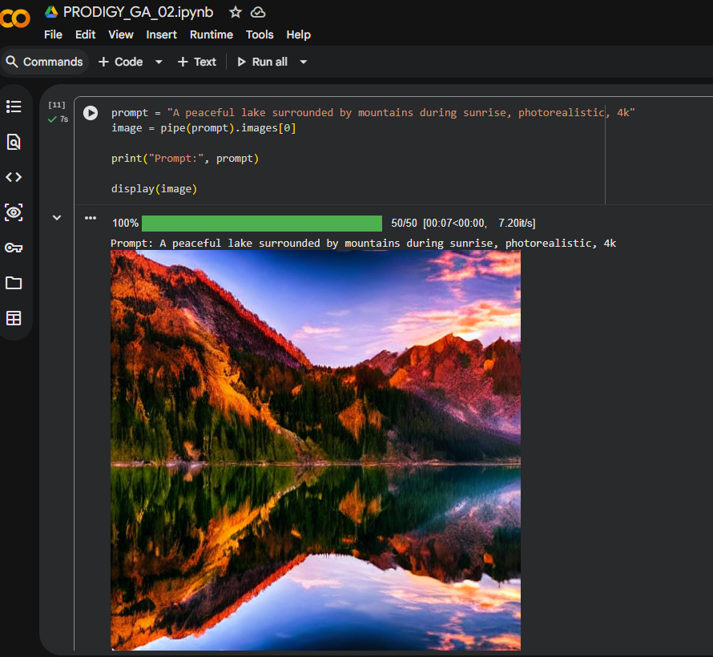
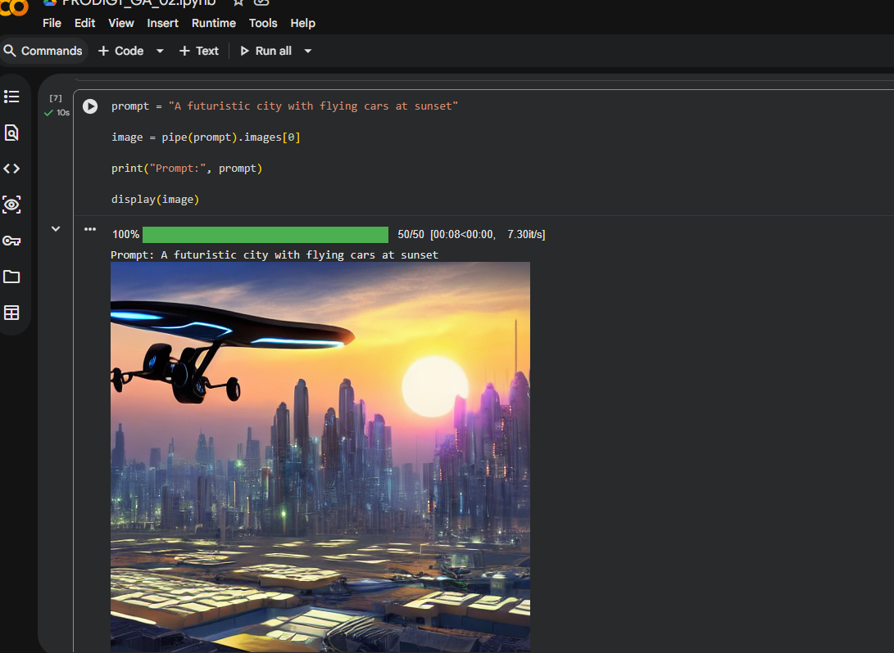
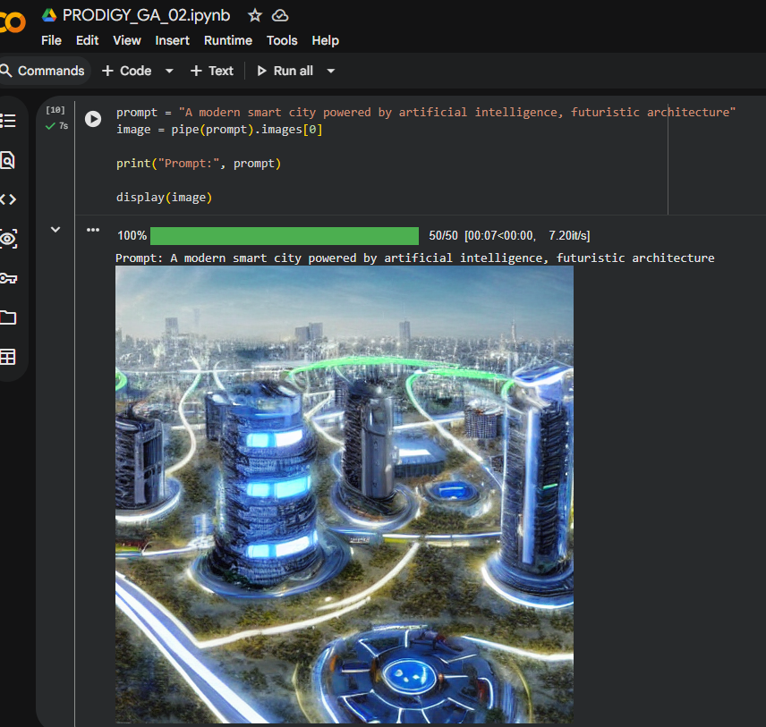

# PRODIGY_GA_02

# Text-to-Image Generation using Pre-trained Models

This project demonstrates **text-to-image generation using a pre-trained Stable Diffusion model**.  
The model generates images based on text prompts using Python and the Diffusers library.

## Technologies Used
Python, Stable Diffusion, Diffusers, PyTorch, Google Colab

## Code
The implementation for generating images is provided in:
image_generation.py

## Generated Images

Prompt: A peaceful lake surrounded by mountains during sunrise, photorealistic, 4k  

A
Prompt:A futuristic city with flying cars at sunset"

Prompt: A modern smart city powered by artificial intelligence, futuristic architecture 

## Author
Anand Muddannavar  
Generative AI Internship Project
